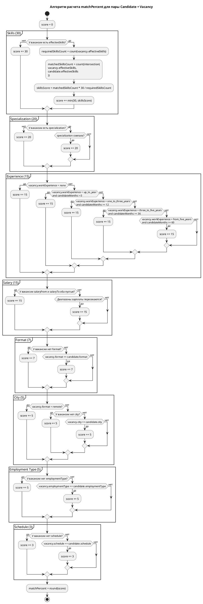

# Matching Algorithm

## Назначение документа

Этот документ фиксирует фактический текущий алгоритм определения степени соответствия кандидата вакансии по коду проекта.

Документ описывает:

- какие данные участвуют в расчёте;
- как именно считается каждый критерий;
- как формируется итоговый `matchPercent`;
- что можно и что нельзя надёжно вывести про смысл весов;
- UML-диаграмму алгоритма.

Важно:

- описание ниже опирается на текущий backend-код, прежде всего на:
  - `backend/src/modules/vacancies/lib/calculate-match-percent.ts`;
  - `backend/src/modules/vacancies/lib/matching.ts`;
  - `backend/src/modules/skills/skills.service.ts`;
  - `backend/src/modules/users/lib/calculate-total-work-experience-months.ts`;
- это не продуктовая спецификация и не объяснение "как должно быть";
- если код будет изменён, этот документ может устареть и должен пересматриваться отдельно.

## 1. Общий принцип

Алгоритм получает уже подготовленную пару:

- `vacancy`
- `candidate`

После этого вызывается функция:

- `calculateMatchPercent(vacancy, candidate)`

Она считает итоговый процент соответствия как сумму баллов по 8 критериям.

Максимальный результат:

- `100`

Итоговая модель:

- есть фиксированный набор критериев;
- у каждого критерия есть свой вес;
- часть критериев бинарные: либо весь вес, либо `0`;
- только критерий навыков может давать частичный балл;
- если часть требований у вакансии не заполнена, по ряду критериев кандидат автоматически получает соответствующий вес.

## 2. Какие поля участвуют в расчёте

### Vacancy

- `effectiveSkills`
- `specialization.id`
- `workExperience`
- `salaryFrom`
- `salaryTo`
- `format`
- `city.id`
- `employmentType`
- `schedule`

### Candidate

- `effectiveSkills`
- `specialization.id`
- `totalWorkExperienceMonths`
- `salaryFrom`
- `salaryTo`
- `format`
- `city.id`
- `employmentType`
- `schedule`

## 3. Подготовленные производные данные

Алгоритм использует не только "сырые" поля сущностей.

### 3.1. Effective skills

Сравнение навыков идёт по `effectiveSkills`, а не просто по явно выбранным `skills`.

`effectiveSkills` строятся так:

- берутся явно указанные навыки;
- из справочника навыков подтягиваются все implied-навыки;
- итоговый набор содержит:
  - `explicitSkills`;
  - `effectiveSkills`;
  - `impliedSkills`.

Следствие:

- кандидат может получить совпадение по навыку не только потому, что указал его напрямую, но и потому, что этот навык логически выведен из другого навыка;
- вакансия тоже сравнивается по расширенному набору навыков.

### 3.2. Общий опыт кандидата

`totalWorkExperienceMonths` считается заранее как сумма полных месяцев по всем записям опыта работы.

Особенности расчёта:

- если `endedAt` пустой, берётся текущая дата;
- неполный последний месяц не засчитывается;
- некорректные интервалы игнорируются;
- итог — одно число в месяцах.

## 4. Веса критериев

Текущие веса в коде:

- `skills = 30`
- `specialization = 20`
- `experience = 15`
- `salary = 15`
- `format = 7`
- `city = 5`
- `employmentType = 5`
- `schedule = 3`

Сумма:

- `100`

## 5. С чем связаны такие веса

По коду нельзя надёжно вывести исходную бизнес-мотивацию этих чисел.

В проекте сейчас нет:

- отдельного документа с rationale по весам;
- explainability-contract;
- комментариев в коде, где было бы зафиксировано, почему выбраны именно такие коэффициенты;
- продуктовой спецификации, связывающей веса с валидацией на данных или A/B-проверкой.

Поэтому строго фактическое утверждение только одно:

- веса зашиты в код как текущая эвристическая модель приоритета критериев.

Ниже можно сделать только осторожную интерпретацию.

### 5.1. Что можно разумно вывести из распределения весов

- Навыки `30`:
  это самый важный критерий, значит алгоритм считает стек и набор технологий главным индикатором пригодности.

- Специализация `20`:
  второй по силе критерий, значит принадлежность к нужному профессиональному направлению считается почти столь же важной, как и конкретные навыки.

- Опыт `15`:
  стаж важен, но уступает навыкам и специализации. Алгоритм трактует опыт как пороговый фильтр достаточности, а не как тонкую шкалу качества.

- Зарплата `15`:
  совпадение ожиданий по деньгам считается столь же важным, как и опыт. Это говорит о том, что алгоритм учитывает не только профессиональную пригодность, но и практическую реализуемость контакта.

- Формат `7`:
  офис/удалёнка/гибрид влияют заметно, но не доминируют.

- Город `5`:
  география учитывается, но слабее формата. Для remote-вакансий этот критерий вообще снимается.

- Employment type `5`:
  тип занятости учитывается как дополнительное ограничение, но не как основной фактор.

- Schedule `3`:
  самый слабый критерий. По текущему коду график считается наименее значимым фактором из всех перечисленных.

### 5.2. Практический смысл текущей модели

Если не пытаться додумывать бизнес-историю, текущая модель фактически кодирует такой приоритет:

1. сначала профессиональная близость:
   навыки + специализация;
2. затем пригодность по уровню и ожиданиям:
   опыт + зарплата;
3. затем организационная совместимость:
   формат + город + тип занятости + график.

Это интерпретация по фактическому распределению весов, а не подтверждённое решение из отдельной продуктовой документации.

## 6. Подробный алгоритм по критериям

## 6.1. Навыки: 30 баллов

Берётся:

- `vacancy.effectiveSkills`
- `candidate.effectiveSkills`

Если у вакансии нет навыков:

- кандидат автоматически получает `30`.

Иначе:

- считается число навыков вакансии, присутствующих у кандидата;
- балл начисляется пропорционально доле совпадений.

Формула:

```text
skillsScore = min(30, matchedSkillsCount * 30 / requiredSkillsCount)
```

Это единственный критерий с частичным начислением.

## 6.2. Специализация: 20 баллов

Если у вакансии нет специализации:

- кандидат автоматически получает `20`.

Если специализация есть:

- совпала специализация -> `20`
- не совпала -> `0`

## 6.3. Опыт: 15 баллов

Берётся:

- `candidate.totalWorkExperienceMonths`

Логика:

- `none` -> всегда `15`
- `up_to_year` -> если опыт `> 0`, то `15`, иначе `0`
- `one_to_three_years` -> если опыт `>= 12`, то `15`, иначе `0`
- `three_to_five_years` -> если опыт `>= 36`, то `15`, иначе `0`
- `from_five_years` -> если опыт `>= 60`, то `15`, иначе `0`

Важно:

- значение `up_to_year` в текущем коде работает как "есть хотя бы какой-то опыт", а не как "опыт не больше года".

## 6.4. Зарплата: 15 баллов

Алгоритм смотрит, пересекается ли зарплатный диапазон кандидата с диапазоном вакансии.

Если у вакансии не указаны ни `salaryFrom`, ни `salaryTo`:

- кандидат автоматически получает `15`.

Иначе проверяется пересечение интервалов:

- либо верхняя граница вакансии отсутствует,
  либо `candidate.salaryFrom <= vacancy.salaryTo`;
- и одновременно:
  - либо нижняя граница вакансии отсутствует,
    либо `candidate.salaryTo >= vacancy.salaryFrom`.

Если пересечение есть:

- `15`

Иначе:

- `0`

Технические допущения:

- если у кандидата нет `salaryFrom`, используется `0`;
- если у кандидата нет `salaryTo`, используется `Number.MAX_SAFE_INTEGER`.

## 6.5. Формат работы: 7 баллов

Если у вакансии не указан формат:

- автоматически `7`.

Иначе:

- `vacancy.format === candidate.format` -> `7`
- иначе -> `0`

## 6.6. Город: 5 баллов

Если вакансия `remote`:

- автоматически `5`.

Если у вакансии не указан город:

- автоматически `5`.

Иначе:

- `vacancy.city.id === candidate.city.id` -> `5`
- иначе -> `0`

## 6.7. Тип занятости: 5 баллов

Если у вакансии не указан `employmentType`:

- автоматически `5`.

Иначе:

- совпало -> `5`
- не совпало -> `0`

## 6.8. График: 3 балла

Если у вакансии не указан `schedule`:

- автоматически `3`.

Иначе:

- совпало -> `3`
- не совпало -> `0`

## 7. Финальная формула

Итоговый процент:

```text
matchPercent =
  skillsScore +
  specializationScore +
  experienceScore +
  salaryScore +
  formatScore +
  cityScore +
  employmentTypeScore +
  scheduleScore
```

В конце результат округляется:

```text
Math.round(score)
```

## 8. Что алгоритм не делает

Текущая реализация не использует:

- текст вакансии `description`;
- `requirements`;
- `niceToHave`;
- `responsibilities`;
- описание кандидата;
- тексты проектов;
- образование;
- GitHub/GitLab;
- какие-либо ML/AI-модели;
- статистику успешных наймов;
- explainability-разбивку по критериям в API-ответе.

То есть это не semantic matching и не AI-ranking, а rule-based weighted scoring.

## 9. Псевдокод

```text
score = 0

score += scoreSkills(vacancy.effectiveSkills, candidate.effectiveSkills)
score += scoreSpecialization(vacancy.specialization, candidate.specialization)
score += scoreExperience(vacancy.workExperience, candidate.totalWorkExperienceMonths)
score += scoreSalary(vacancy.salaryFrom, vacancy.salaryTo, candidate.salaryFrom, candidate.salaryTo)
score += scoreFormat(vacancy.format, candidate.format)
score += scoreCity(vacancy.format, vacancy.city, candidate.city)
score += scoreEmploymentType(vacancy.employmentType, candidate.employmentType)
score += scoreSchedule(vacancy.schedule, candidate.schedule)

return round(score)
```

## 10. UML-диаграмма алгоритма

Ниже `PlantUML Activity Diagram`, которая показывает только сам расчёт score для уже готовой пары `candidate + vacancy`.



## 11. Короткий вывод

Текущий matching в проекте — это rule-based weighted scoring, где:

- главный приоритет отдан навыкам и специализации;
- опыт и зарплата считаются следующими по важности;
- формат, город, тип занятости и график выступают как более слабые ограничения;
- отсутствие части требований у вакансии уменьшает строгость отбора;
- алгоритм не объясняет результат по критериям наружу и не использует текстовый или AI-анализ.
